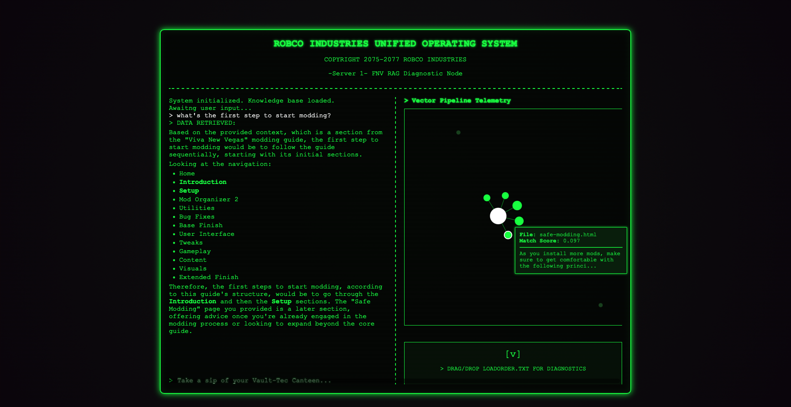

# FNVMA: Fallout New Vegas Modding Assistant


> A production-grade, decoupled Retrieval-Augmented Generation (RAG) application designed to diagnose unstable load orders and answer highly specific technical modding questions for Fallout: New Vegas.
> 
> **🔴 Live Application:** [fnvma.vercel.app](https://fnvma.vercel.app)

## Executive Summary
FNVMA transitions the traditional approach to game modding diagnostics from manual text-parsing to a modern, AI-driven workflow. Originally built as a monolithic prototype, the system has been entirely re-architected into a scalable client-server application. It demonstrates full-stack machine learning infrastructure, interactive data visualization, and applied statistical analysis to resolve complex modding conflicts and prevent game instability.

## Application Interface
 *The FNVMA frontend featuring real-time, force-directed network graph visualization of the semantic vector space.*

## Core Architecture & AI Pipeline

The backend is engineered for zero cold-start latency and mathematical precision in document retrieval:

* **Decoupled FastAPI Backend:** Containerized and hosted on Hugging Face Spaces. Utilizes application lifespan managers to cache embedding models directly in system RAM, serving requests rapidly and reliably.
* **Hybrid Search Ensemble:** Combines semantic meaning and exact-keyword frequencies—crucial for identifying specific `.esp` and `.dll` files.
  * *Dense Retriever:* Powered by **Qdrant Cloud** for scalable, stateless k-NN semantic similarity.
  * *Sparse Retriever:* Utilizes BM25 for exact token matching.
* **Dynamic Knowledge Expansion:** Integrates directly with the Nexus Mods API to pull live mod descriptions, version histories, and endorsement metrics. This ensures the LLM weights community standards heavily and avoids recommending outdated patches.
* **Cross-Encoder Re-ranking:** The ensemble output is routed through a HuggingFace Cross-Encoder (`BAAI/bge-reranker-base`). By executing the cross-encoding pipeline manually, the system preserves raw mathematical match scores and compresses candidate document pools to maximize the LLM's context window relevance.
* **Optimized Inference Batching:** Engineered a batch-processing endpoint that compresses the diagnostic workload. Analyzing a 15-mod load order now requires only **1 LLM inference call** instead of 15, preventing `RESOURCE_EXHAUSTED` timeouts and drastically reducing network overhead.

## MLOps, Telemetry, & CI/CD

Observability and automation are built into the core of FNVMA to prove the efficacy of the reranking pipeline and ensure data remains up-to-date without infrastructure costs.

* **GitOps Deployment Automation:** A dedicated GitHub Actions workflow (`sync_to_hf.yml`) automatically mirrors the GitHub repository to the Hugging Face production server upon every push, ensuring continuous delivery.
* **Automated Data Ingestion (CI/CD):** Implemented a scheduled GitHub Actions workflow (`update_kb.yml`) that executes dual ingestion scripts. It parses baseline modding guides and safely navigates Nexus Mods API rate limits to fetch trending mods, embeds the combined data, and upserts it directly to Qdrant Cloud without human intervention.
* **Interactive Semantic Visualization (D3.js):** The custom vanilla frontend (deployed on Vercel) features a real-time, force-directed network graph. This maps the mathematical distance between user queries and high-dimensional document chunks, making the vector space visible and interactive.
* **Asynchronous Telemetry Engine:** A persistent SQLite database silently logs pipeline metrics for every query. Captured data includes candidate pool sizes, selected context chunks, latency metrics, and average rerank scores.
* **Statistical Performance Profiling:** Utilizes `pandas` and `scikit-learn` to conduct Ordinary Least Squares (OLS) regression on logged telemetry. This isolates vector retrieval overhead from API network constraints, allowing us to mathematically optimize the `k` value in the ensemble retriever based on baseline LLM generation latency.

## Installation & Local Setup

Follow these steps to run the complete, decoupled environment on your local machine.

### Prerequisites
* Python 3.10 or 3.11
* A Qdrant Cloud cluster (or a local Qdrant instance)
* A Gemini API Key
* A Nexus Mods Personal API Key

### 1. Backend Installation & Setup
Navigate to the backend directory and set up your virtual environment:
```bash
python -m venv venv
source venv/bin/activate  # On Windows use: venv\Scripts\activate
pip install -r requirements.txt
```
### 2. Setting Up API Credentials
Create a `.env` file in the root directory and setup your API credentials:
```
GEMINI_API_KEY=your_gemini_api_key_here
NEXUS_API_KEY=your_nexus_api_key_here
QDRANT_URL=your_qdrant_cloud_url_here
QDRANT_API_KEY=your_qdrant_api_key_here
```

### 3. Launching the Backend and Frontend
We can now launch the backend FastAPI development server. 
First, navigate to the backend folder and enter:
```
uvicorn main:app --reload --port 7860
```
The documentation and endpoints will be live at http://localhost:7860/docs.


Our frontend is built entirely on vanilla modern Javascript and D3.js. 

Afterwards, we can launch the frontend by navigating to the frontend folder with any lightweight static server (e.g. Python's built-in server, VS Code's Live Server):
```
cd ../frontend
python -m http.server 8000
```
Open your browser and navigate to http://localhost:8000 to interact with the application.
Note: Ensure your frontend configuration directs API fetches to your local backend endpoint (http://localhost:7860) during development.

